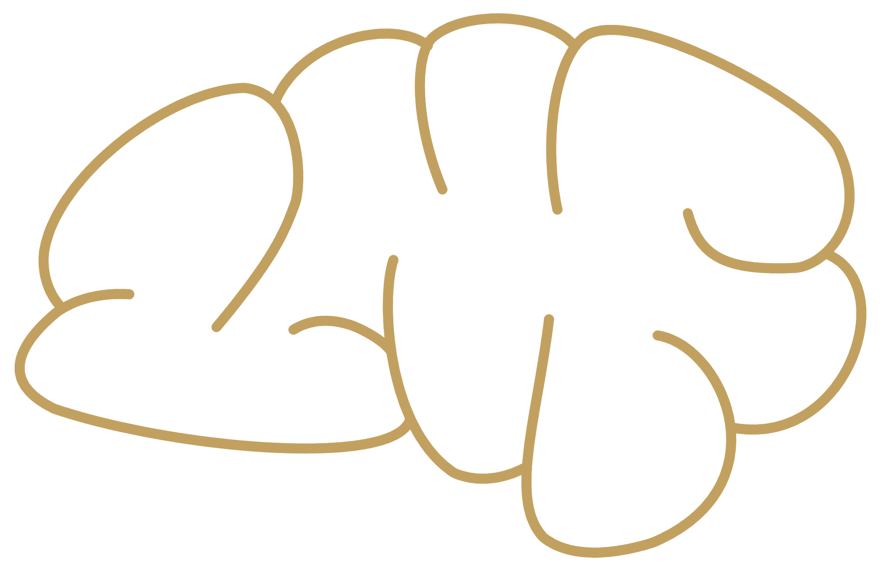

# second_brain

This project was started during the SUSE hackWeek 2023. For further information
see [hackweek project page](https://hackweek.opensuse.org/23/projects/create-a-trello-tool-desktop-software-to-track-daily-task-and-improve-personnal-productivity)

## Why ?

To track tasks and organize agenda, you can use some web app like Trello, or
Notion. But you probably will need to subscribe to a plan. And your data ...
Don't know where they go. I didn't find an opensource project that create a kind
of app that can be run as a desktop app from our favorite distribution.

## App Features

* Dashboards as home page to get a short list of todo task, with a view on the
  Calendar and print the local weather, date, etc...
* Page with list of tasks arranged in a tab "todo", "In Progress", "to verify",
  "Done".
* Have a calendar automatically fill with update of tasks.

## App UI

See [UI overview](./doc/ui_overview.md)
